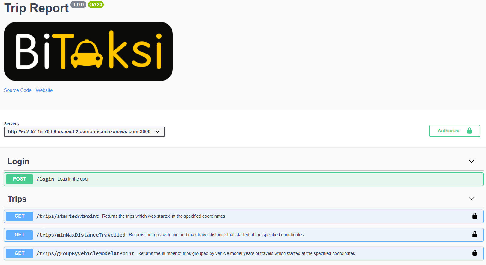
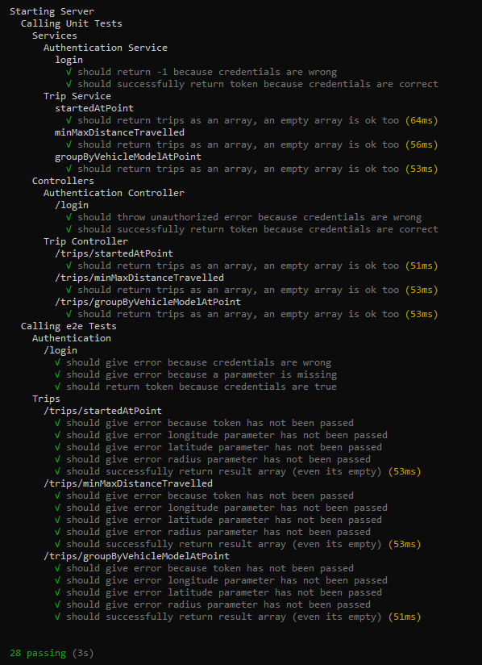

# Trip Report 🚖

A reporting service for trips.

<br>

# Installation

- Clone repository or download it manually
  ```bash
  git clone https://github.com/xafm/trip-report
  ```
- Create <strong>.env</strong> file in the root project directory
- Set required environment variables in .env file. Required envrionment variables are shown below with examples
  ```bash
  PORT=3000
  JWT_SECRET="TOPSECRET"
  DB_CONNECTION_STRING=mongodb+srv://...
  ```
- Install dependencies

  ```bash
  npm install
  ```

- Start the application
  ```bash
  npm start
  ```
  or with nodemon
  ```bash
  npm run watch
  ```
  That's all! Application should be running on the port you've specified. <br><br>
  To run tests
  ```bash
  npm test
  ```

## Install with docker

```bash
docker container run 
  -e DB_CONNECTION_STRING=mongodb+srv://... 
  -e JWT_SECRET=TOPSECRET 
  -p <desired_port>:3000 xafm/trip-report 
```
> Note: You must set the environment variables

<br>

# Swagger
You can test see and test all endpoints with swagger ui. <br>
http://ec2-52-15-70-69.us-east-2.compute.amazonaws.com:3000/api-docs

<br><br>

# AWS
Application has been deployed to aws and the container runs on a ec2 instance. You can use the link below.
http://ec2-52-15-70-69.us-east-2.compute.amazonaws.com:3000/

<br>

# Test Result

<br>
More tests can be added<br>
<br>


# Endpoints

### POST /login

Logs the user in. It returns token if the credentials are correct, otherwise error.
<br><br>
Request Body

```bash
{
	"username":"admin",
	"password": "1234"
}
```

<br>

Example Responses <br>

Success

```bash
{
  "success": true,
  "data": {
    "token": "eyJhbGciOiJIUzI1NiIsInR5cCI6IkpXVCJ9.eyJ1c2VybmFtZSI6ImFkbWluIiwiaWF0IjoxNjEyNTk4ODI1fQ"
  }
}
```

Error

```bash
{
  "success": false,
  "errors": [
    {
      "message": "Incorrect username or password"
    }
  ]
}
```

### GET /trips/startedAtPoint

Returns the trips which was started at the specified coordinates
<br><br>
Query Parameters

```bash
{
  "longitude": -97.70929823,
  "latitude": 31.04685111,
  "radius": 500,
  "startDate": 2015, // optional
  "completeDate": 2021-02-10 // optional
}
```

<br>

Example Responses <br>

Success

```bash
{
  "success": true,
  "data": [{
    "_id": "5cebab1fa2752d2aa3d25859",
    "distance_travelled": 790,
    "driver_rating": 5,
    "rider_rating": 5,
    "start_zip_code": null,
    "end_zip_code": "",
    "charity_id": null,
    "requested_car_category": "REGULAR",
    "free_credit_used": null,
    "surge_factor": 0,
    "color": "Black",
    "make": "Cadillac",
    "model": "XTS",
    "year": 2013,
    "rating": 5,
    "Date": "2016-06-04",
    "PRCP": 0.1,
    "TMAX": 86,
    "TMIN": 67,
    "AWND": 4.9,
    "GustSpeed2": 13,
    "Fog": 1,
    "HeavyFog": 0,
    "Thunder": 0,
    "start": {
      "type": "Point",
      "coordinates": [
        -97.70929823,
        31.04685111
      ]
    },
    "end": {
      "type": "Point",
      "coordinates": [
        -97.14107472,
        30.39216848
      ]
    },
    "complete_date": "2016-06-04T15:26:07.000Z",
    "start_date": "2016-06-04T15:24:25.000Z",
    "distance": 0
  }]
}
```

Error

```bash
{
  "success": false,
  "errors": [
    {
      "message": "Longitude must be between -180 and 180",
      "param": "longitude"
    }
  ]
}
```
### GET /trips/minMaxDistanceTravelled

Returns the trips with min and max travel distance that started at the specified coordinates
<br><br>
Query Parameters

```bash
{
  "longitude": -97.70929823,
  "latitude": 31.04685111,
  "radius": 500
}
```

<br>

Example Responses <br>

Success

```bash
{
  "success": true,
  "data": {
    "minDistanceTravel": {
      "_id": "5cebab1fa2752d2aa3d25859",
      "distance_travelled": 790,
      "driver_rating": 5,
      "rider_rating": 5,
      "start_zip_code": null,
      "end_zip_code": "",
      "charity_id": null,
      "requested_car_category": "REGULAR",
      "free_credit_used": null,
      "surge_factor": 0,
      "color": "Black",
      "make": "Cadillac",
      "model": "XTS",
      "year": 2013,
      "rating": 5,
      "Date": "2016-06-04",
      "PRCP": 0.1,
      "TMAX": 86,
      "TMIN": 67,
      "AWND": 4.9,
      "GustSpeed2": 13,
      "Fog": 1,
      "HeavyFog": 0,
      "Thunder": 0,
      "start": {
        "type": "Point",
        "coordinates": [
          -97.70929823,
          31.04685111
        ]
      },
      "end": {
        "type": "Point",
        "coordinates": [
          -97.14107472,
          30.39216848
        ]
      },
      "complete_date": "2016-06-04T15:26:07.000Z",
      "start_date": "2016-06-04T15:24:25.000Z",
      "distance": 0
    },
    "maxDistanceTravel": {
      "_id": "5cebab23a2752d2aa3d26640",
      "distance_travelled": 5624,
      "driver_rating": 5,
      "rider_rating": 5,
      "start_zip_code": null,
      "end_zip_code": "",
      "charity_id": null,
      "requested_car_category": "REGULAR",
      "free_credit_used": null,
      "surge_factor": 0,
      "color": "Black",
      "make": "Nissan",
      "model": "Versa Note",
      "year": 2014,
      "rating": 4.84444444444,
      "Date": "2016-06-26",
      "PRCP": 0,
      "TMAX": 95,
      "TMIN": 76,
      "AWND": 4.9,
      "GustSpeed2": 13,
      "Fog": 1,
      "HeavyFog": 0,
      "Thunder": 0,
      "start": {
        "type": "Point",
        "coordinates": [
          -97.71161403,
          31.049119440000002
        ]
      },
      "end": {
        "type": "Point",
        "coordinates": [
          -97.36393606,
          31.13381708
        ]
      },
      "complete_date": "2016-06-26T02:35:48.000Z",
      "start_date": "2016-06-26T02:23:54.000Z",
      "distance": 335.4687138051517
    }
  }
}
```

Error

```bash
{
  "success": false,
  "errors": [
    {
      "message": "Longitude must be between -180 and 180",
      "param": "longitude"
    }
  ]
}
```
### GET /trips/groupByVehicleModelAtPoint

Returns the number of trips grouped by vehicle model years of travels which started at the specified coordinates
<br><br>
Request Body

```bash
{
  "longitude": -97.70929823,
  "latitude": 31.04685111,
  "radius": 500
}
```

<br>

Example Responses <br>

Success

```bash
{
  "success": true,
  "data": [{
      "numberOfTrips": 1,
      "year": 2013
    },
    {
      "numberOfTrips": 1,
      "year": 2014
    }
  ]
}
```

Error

```bash
{
  "success": false,
  "errors": [
    {
      "message": "Longitude must be between -180 and 180",
      "param": "longitude"
    }
  ]
}
```